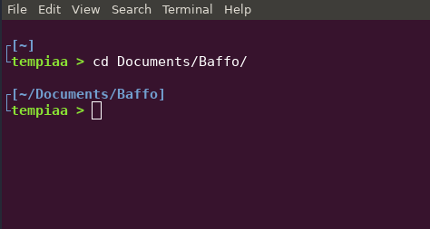

# Linux configuration
This repository contains my personal configuration of Linux used with i3 windows manager.

It contains:
* .bashrc simple settings
* vim configuration with plugins for c, python and vhdl
* i3 configuration with i3blocks

## Prerequisites
Vim plugins doesn't need any other program except for vim itself.
For i3 windows manager some application and fonts need to be installed.
You can follow the guide for basic i3 configuration settings here https://youtu.be/8-S0cWnLBKg and here ([setupi3]).  
Everything I did, except few modification, are well explained there.
Install all the software and font in that guide.

## Bashrc
It contains my shell layout, set vim as default editor, plus contains some alias of some application that I use.
This is how the terminal looks like:

  

## Vim
Copy `.vimrc` and `.vim` folder inside your home directory, then extract the zip file `.vim/plugged/plugin.zip` inside that folder.  
Other plugins can be installed writing inside `.vimrc`:

```bash
$ Plug *git-repository-name*
```
and then digit inside vim:

```bash
:PlugInstall
```
or putting the plugin folder directly inside `.vim/plugged/`.  
The installation process is explained in details inside [plug.vim].

In general it contains:
* Color themes for coding
* NerdTree that allows to see and move around the directory tree
* C plugins for syntax check, compilation errors, c automatic code insertion
* Python plugins for documentation, syntax check
* VHDL plugin with automatic template
* Vim shell and others

You can check the documentation of every plugin inside vim with:

```bash
:help *plugin-name*
```

## i3wm
The configurations can be found inside `.config` and `i3blocks` folders.
The `.config` folder content is situated inside your `.config` folder in your home directory. The `i3blocks` is situated in `/usr/share/`.

Please follow this guide ([setupi3]) for the complete configuration.  
During the configuration in that guide I encountered some problems regarding the screen brightness keyboard buttons and the volume in the i3 bar.
* for the brightness check here ([brightness unresponsive])
* the volume bar has been solved changing the [volume] script.


[plug.vim]: .vim/autoload/plug.vim
[setupi3]: https://github.com/bookercodes/setupi3
[brightness unresponsive]: https://www.reddit.com/r/i3wm/comments/8aorse/solution_volumebrightness_keys_unresponsive/
[volume]: i3blocks/volume
